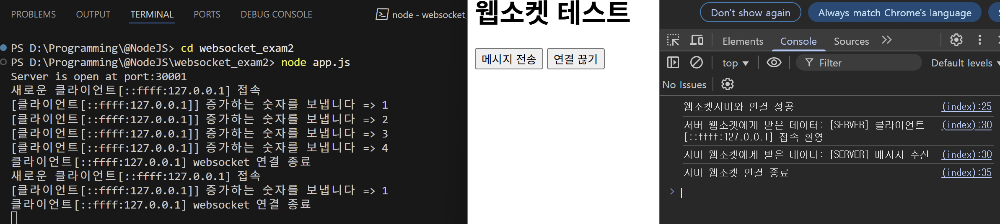

### 참고 블로그
https://curryyou.tistory.com/348

---
### 실행
```
> git clone https://github.com/kmg22/NodeJS-WebSocket.git
> cd websocket_exam2

> node -v
> npm init -y
> npm install ws
> npm install express
```
---
### 예시
